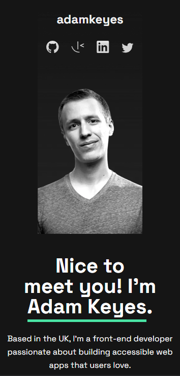

# Frontend Mentor - Single-page developer portfolio solution

This is a solution to the [Single-page developer portfolio challenge on Frontend Mentor](https://www.frontendmentor.io/challenges/singlepage-developer-portfolio-bBVj2ZPi-x). Frontend Mentor challenges help you improve your coding skills by building realistic projects. 

## Table of contents

- [Overview](#overview)
  - [The challenge](#the-challenge)
  - [Screenshot](#screenshot)
  - [Links](#links)
- [My process](#my-process)
  - [Built with](#built-with)
  - [What I learned](#what-i-learned)
  - [Continued development](#continued-development)
  - [Useful resources](#useful-resources)
- [Author](#author)


## Overview

### The challenge

Users should be able to:

- Receive an error message when the `form` is submitted if:
  - Any field is empty
  - The email address is not formatted correctly
- View the optimal layout for the interface depending on their device's screen size
- See hover and focus states for all interactive elements on the page
- **Bonus**: Hook the form up so it sends and stores the user's enquiry (you can use a spreadsheet or Airtable to save the enquiries)
- **Bonus**: Add your own details (image, skills, projects) to replace the ones in the design

### Screenshot

#### Mobile View


#### Tablet View


#### Desktop View


### Links

- Solution URL: [Github Link](https://github.com/DeviantSchemist/juniordevportfolio)
- Live Site URL: [Live Site](https://steady-sunburst-4c2224.netlify.app/)

## My process

### Built with

- Semantic HTML5 markup
- CSS custom properties
- Flexbox
- CSS Grid
- Mobile-first workflow
- SASS/SCSS


### What I learned

This was my first major project using SASS. Utilizing that in conjuction with HTML greatly accustomed me to its syntax. As development continued, the code became more and more complex, with nesting CSS rules becoming the norm. I became comfortable working with a big code file as a result. The sheer amount of HTML and CSS that I had to write solidified my understanding of both languages.

Using both CSS Grid and Flexbox for styling gave me much more experience with these two concepts. I used both in areas where it was appropriate for me to achieve the desired layout.

Working with Figma to get things such as the margin and padding correct helped me experience how it would be like in the workforce, when I would have to work with a designer's files and implement them.

I became accustomed to the mobile-first workflow, as well as using media queries for whatever screen size that I need to develop for.

Minding accesibility when developing websites is something that is overlooked when building projects quickly and using a ton of frameworks. I did not use any of that for this project, and took my time to carefully structure my HTML content. I became much better at developing with semantic HTML.


Below are several SCSS code snippets from this project


This first snippet is a reusable style for each project in the projects section.
```css
@mixin project-style {
	img {
		width: 100%;
		margin-top: 40px;
	}

	h2 {
		font-size: 24px;
		font-weight: bold;
		margin-top: 20px;
	}

	.techstack {
		display: flex;
		gap: 18px;
		margin-top: 10px;
		font-size: 18px;
	}

	.links {
		display: flex;
		width: 70%;
		justify-content: space-between;
		margin-top: 20px;

		p {
			border-bottom: 2px solid #4EE1A0;
		}
	}
}
```

This snippet below is how the inputs change color when you focus on them.

```css
input {
  background: transparent;
  border: none;
  margin: 0 0 10px 20px;

  &:focus {
    outline: none;
  }
}

input:first-child {
  &:focus {
    & + .underline-input {
      border-bottom: 2px solid #4EE1A0;
    }
  }
}

input:nth-of-type(2) {
  margin-top: 20px;

  &:focus {
    & + .underline-input {
      border-bottom: 2px solid #4EE1A0;
    }
  }
}
```

### Continued development

This project is in continual development, and as such, this section will be updated as each feature is implemented and/or polished.

- Implement input validation for contact form.
- Fix mouse hover style on project section.
- Increase clickable area of icons in the header and footer.

Moving forward, for a project such as this that requires a lot of lines of code to manage, I will most likely be using a framework like ReactJS for development. I made this using plain HTML and CSS in order to practice those skills and increase my existing knowledge of the fundamentals.

I will continue applying mobile-first development workflow as well as accesible HTML structuring.


### Useful resources

- [CSS Reset](https://meyerweb.com/eric/tools/css/reset/) - I use this CSS reset file for almost every project I work on. There are other ones that you can use, but this is my default. Highly recommended.

- [W3 Schools](https://www.w3schools.com/) - One could call this the web development bible. Most likely it will be the first site that pops up anytime you have an inquiry about HTML, CSS, and Javascript.

## Author

- Github - [DeviantSchemist](https://github.com/DeviantSchemist)
- Frontend Mentor - [@DeviantSchemist](https://www.frontendmentor.io/profile/yourusername)
